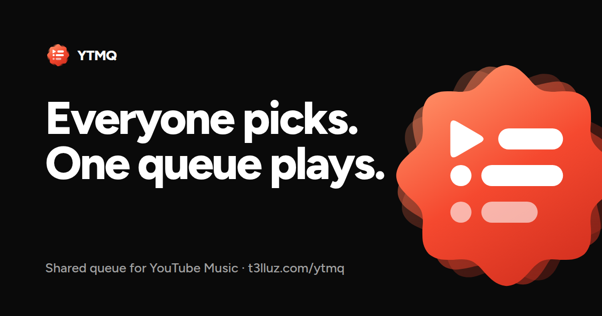

# YTMQ

A shared queue for **YouTube Music**. Friends open a link on their phones, search, and add songs; the host's YouTube Music plays them in order, with now playing, lyrics and controls on every screen. Spotify can be followed too, for now playing and lyrics.

**[Open YTMQ](https://t3lluz.com/ytmq/)** · [Docs](https://t3lluz.com/ytmq/docs) · [Install the extension](https://t3lluz.com/ytmq/docs/install) · [API](https://t3lluz.com/ytmq/docs/api) · [Chrome zip](https://t3lluz.com/ytmq/ytmq-extension.zip) · [Firefox add-on](https://t3lluz.com/ytmq/ytmq-firefox.xpi) · [Userscript](https://t3lluz.com/ytmq/ytmq-connect.user.js)

| Docs page | For |
|---|---|
| [Overview](https://t3lluz.com/ytmq/docs) | What it is, with a diagram of the parts |
| [Install the extension](https://t3lluz.com/ytmq/docs/install) | Chrome and Firefox, step by step (`/ytmq/setup` redirects here) |
| [Host a lobby](https://t3lluz.com/ytmq/docs/hosting) · [Join as a guest](https://t3lluz.com/ytmq/docs/guests) | Using it |
| [How it works](https://t3lluz.com/ytmq/docs/how-it-works) · [API](https://t3lluz.com/ytmq/docs/api) | The path of a song, every endpoint, the realtime protocol |
| [Troubleshooting](https://t3lluz.com/ytmq/docs/troubleshooting) · [Changelog](https://t3lluz.com/ytmq/docs/changelog) | Fixes and history |

Any casing works (`/YTMQ`, `/Ytmq`, …). Push to `main` and it is live within a minute.

Everything runs on t3lluz: one Deno server (`server/`) serves the app, the API, the realtime WebSocket and the search/lyrics functions, with the data in SQLite. How it is deployed and exposed: [deploy/server/README.md](deploy/server/README.md).

## How it works

1. The host opens [t3lluz.com/ytmq](https://t3lluz.com/ytmq/) and creates a lobby. Guests join with the 6-character code, the link or the QR.
2. The host connects YouTube Music (the extension does it by itself once installed, in Chrome or Firefox).
3. Guests search and add songs; they land in the host's YouTube Music queue. Playback controls, lyrics and now playing follow along on every phone.

## Local development

1. `npm install`
2. Start the API: `cd server && deno task dev` (port 8787, data in `.data/`). Or skip it and use the live API: `YTMQ_API_PROXY=https://t3lluz.com npm run dev`.
3. `npm run dev` → open `http://localhost:5173/ytmq/`

Optional `.env.local`:
- `VITE_PUBLIC_SITE_URL`: HTTPS site root the YouTube Music bridge loads from when you develop on `http://localhost` (e.g. `https://t3lluz.com/ytmq`).
- `VITE_API_URL`: absolute API URL, if it is not the app's own origin.
- `VITE_SPOTIFY_CLIENT_ID`: only to override the built-in Spotify app.

No secrets anywhere: search scrapes YouTube Music's own web API server-side, and lyrics come from public sources.

## Spotify (optional host follower)

Spotify uses the official Web API (PKCE) from the host's YTMQ tab. No extension, no Client ID prompt. After login, YTMQ reads the active Spotify player and shows that track on lyrics, now playing, and recently played. It does not push the shared queue onto Spotify.

The app already ships a public Client ID. On the Spotify dashboard, add these exact redirect URIs (trailing slash included):
- `http://127.0.0.1:5173/ytmq/` (Spotify rejects `localhost`; open the dev server at 127.0.0.1 when testing Spotify)
- `https://t3lluz.com/ytmq/`

Then play something in the Spotify app, click **Connect Spotify** in Admin, and approve access. Keep the YTMQ host tab open.

Skip / pause / seek from YTMQ need Spotify Premium. Following what is playing works on Free.

You can connect YouTube Music and Spotify at the same time; now-playing prefers Spotify while it is actively publishing.

Guest links and QR codes point at `/ytmq/room/<id>`; the server answers any unknown path under `/ytmq/` with the app.

## Browser extension (host auto-connect)

The `extension/` folder is a Manifest V3 extension for Chrome and Firefox that connects **every** `music.youtube.com` tab to your lobby: no Tampermonkey, no console pasting, and it survives reloads and browser restarts. Two surfaces, built on the same view (`extension/ui.js`):

- **The overlay on YouTube Music** (`ytm-panel.js`): a pill above the player that opens into the panel. It is about that tab: the lobby code and QR, who is listening, the guest queue flowing into YouTube Music (remove from there), songs that did not sync yet (Retry), and what YouTube Music plays when the queue runs dry. Drag the pill anywhere; double-click puts it back.
- **The toolbar popup** (`popup.js`): the lobby as a whole. It talks to the server itself, so it follows YouTube Music *and* Spotify, its controls reach whichever player is active, and it works with no YouTube Music tab open. A Sources list shows how each is doing and what to do next.

**Install (one time).** The same steps, with a download button and an install check, are at [t3lluz.com/ytmq/docs/install](https://t3lluz.com/ytmq/docs/install):

1. Download [ytmq-extension.zip](https://t3lluz.com/ytmq/ytmq-extension.zip) and unzip it somewhere permanent (or use the `extension/` folder of a checkout).
2. Open `chrome://extensions` and turn on **Developer mode**.
3. Click **Load unpacked** and pick the folder.

**Updates.** Chrome does not update unpacked extensions, so YTMQ does what it can:

- The bridge, which is most of the logic, is loaded from the live site every time a tab connects. Fixes there reach you without doing anything. If YouTube Music ever refuses it, the extension uses the copy it shipped with.
- For the rest, the site publishes a fingerprint of the extension's files ([ytmq-extension.json](https://t3lluz.com/ytmq/ytmq-extension.json)). When yours differs, the toolbar icon says **NEW** and the panel and popup show **Download** and **Reload**. Unzip the download over the same folder, press Reload, done.

**How it works:** the host clicks *Connect YouTube Music* in the lobby, which opens `music.youtube.com` with the room id and API address in the URL. The content script captures them before YT Music strips the query string and stores the session (`chrome.storage.local` + `localStorage`, 7-day expiry). The service worker then injects the bridge into the page's main world. Every later YT Music tab reconnects from the stored session. The toolbar popup shows the linked room and has **Disconnect**.

`scripts/pack-extension.mjs` zips the extension and writes the fingerprint into `dist/` on every build. The fingerprint leaves out `ytmusic-bridge.js`, since that comes from the site anyway.

### Firefox

The same files, with a Firefox manifest written at pack time (`scripts/extension-files.mjs`: an event page instead of a service worker, the id `ytmq@t3lluz.com`, Firefox 140+). Install is one click on [t3lluz.com/ytmq/docs/install](https://t3lluz.com/ytmq/docs/install): **Add to Firefox**, then *Continue to installation* and *Add*. Works in Firefox forks too (LibreWolf, Zen, Floorp).

Release Firefox only installs add-ons Mozilla signed. `scripts/sign-firefox.mjs` gets each new build signed as an *unlisted* add-on (signed, but only offered here) and publishes `ytmq-firefox.xpi` plus `ytmq-firefox-updates.json`, which the manifest's `update_url` points at, so Firefox updates it like any other add-on. It runs in the t3lluz deploy and signs only when the extension changed. After each deploy, `scripts/firefox-page.mjs` brings the add-on's page on addons.mozilla.org (name, summary, description, homepage, icon, screenshots) in line with [store/firefox/](store/firefox/): edit `listing.json` or swap a screenshot, merge, and the page follows. Mozilla throttles screenshot uploads for up to an hour, so that runs as its own job and never holds up a deploy. Two differences from Chrome, both because Mozilla does not allow code loaded from a server: Firefox runs the bridge it shipped with instead of the live one, and a bridge change means a new signed build (the deploy makes it).

Until a signed build exists, the install page offers `ytmq-firefox-unsigned.xpi` with the about:debugging and `xpinstall.signatures.required` routes.

## Design

One accent, YTMQ red (`#F5492F`, with `#D93A26` under white text), on flat near-black surfaces; Figtree for everything on the site, YouTube Music's own font inside the extension. Tokens live in the `@theme` block of [src/index.css](src/index.css). Album art drives the now-playing colors.

The mark is an 8-lobe Material 3 Expressive "cookie" with a play-and-list glyph and a rotated trail. Its SVG sources are in [design/brand/](design/brand/); `node scripts/render-icons.mjs` turns them into the extension PNGs and the touch icon (set `CHROMIUM` to a Chrome binary if Playwright has none). The React version is [src/components/YtmqLogo.tsx](src/components/YtmqLogo.tsx).

## Tests

- `npx playwright test -c playwright.smoke.config.ts`: mocked-backend smoke tests (no server needed).
- `npm run test:e2e`: end-to-end against a local server (`cd server && deno task dev`). See [tests/README.md](tests/README.md).
- `cd server && deno task check`: type-check the server.

## Architecture

See [docs/AGENT.md](docs/AGENT.md) for product scope, data model and routes, and the public [How it works](https://t3lluz.com/ytmq/docs/how-it-works) and [API](https://t3lluz.com/ytmq/docs/api) pages.
