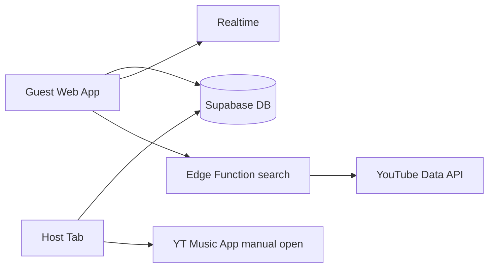

# YTMQ — Agent playbook

YouTube Music **shared queue**: host plays in **YT Music app**; **guests** use the **web app** to search and manage a **realtime shared queue**. Repo: greenfield (git only until scaffolded). **Goal:** one-day MVP, **$0** stack.

---

## Part 1 — Product

**Roles**
- **Host:** Creates lobby (link/QR/code). Playback only in **YouTube Music app** after setup. Does **not** need guest UI for daily use.
- **Guest:** Joins via web; search; add/remove/reorder queue; optional nickname.

**Features (priority)**

| P0 (today) | P1 (later) |
|------------|------------|
| Lobby create/join, QR, share link | Browser extension / ytmusicapi host bridge |
| Realtime queue: add, remove, reorder | Auto-inject into YT Music queue |
| Search songs (+ simple artist list) | Full artist discography, albums, play counts |
| Host tab: see queue, open `music.youtube.com/watch?v=` | Guest auth, moderation, PWA |

**UI:** Minimal, dark-friendly, mobile-first. **3 tabs:** Search | Queue | Room. Large touch targets; toasts; clear empty states.

**Non-goals v1:** In-app playback for guests, user accounts, payments, lyrics.

---

## Part 2 — Constraints (read before coding)

1. **No official YT Music queue API** for third-party web apps.
2. **Today's host sync:** Host tab shows queue + **open track in YT Music** (new tab). True queue injection = later (extension or ytmusicapi sidecar).
3. **GitHub Pages = static only.** Need **Supabase** (DB + Realtime + Edge Functions) for API/search proxy.
4. **Search:** YouTube Data API v3 via Edge Function (key never in frontend). Not 1:1 with YT Music catalog; OK for MVP.
5. **ToS:** Unofficial YT Music tooling is gray; personal/friends use; rate-limit search.

---

## Part 3 — Stack (free)

| Layer | Service |
|-------|---------|
| DB + Realtime | Supabase (free) |
| Search proxy | Supabase Edge Function `search` |
| Frontend | Vite + React + TS + Tailwind |
| Hosting | GitHub Pages (`base: '/YTMQ/'`) |
| QR | `qrcode` (client) |

**Env (frontend):** `VITE_SUPABASE_URL`, `VITE_SUPABASE_ANON_KEY`  
**Secrets (Supabase only):** `YOUTUBE_API_KEY` — never commit `service_role` or YouTube key.

---

## Part 4 — User setup (user does first; agent waits for values)

1. **GitHub:** Repo `YTMQ`. Pages via GitHub Actions. URL: `https://<user>.github.io/YTMQ/`.
2. **Supabase:** New project → copy Project URL + **anon** key. Enable Realtime on `queue_items` after migration.
3. **YouTube:** Cloud Console → enable YouTube Data API v3 → API key → set as Supabase secret for Edge Function.
4. **Local:** Node 20+, pnpm/npm, optional Supabase CLI.
5. User pastes into chat / `.env.local` (not committed):

```text
VITE_SUPABASE_URL=https://xxxx.supabase.co
VITE_SUPABASE_ANON_KEY=eyJ...
# YOUTUBE_API_KEY → supabase secrets only
```

---

## Part 5 — Data model

**`rooms`:** `id` (uuid PK), `code` (text unique), `host_token` (text), `created_at`, `expires_at`

**`queue_items`:** `id`, `room_id` (FK), `position` (int), `video_id`, `title`, `channel_title`, `thumbnail_url`, `added_by` (text), `created_at`

**Optional:** `participants` (`room_id`, `nickname`, `last_seen`)

**RPC:** `create_room()` → `{ room_id, code, host_token }`  
**Join:** resolve `code` → `room_id`

**RLS:** Room-scoped SELECT/INSERT/UPDATE/DELETE on `queue_items` (no wide-open public write). Realtime on `queue_items`.

**Events (conceptual):** `queue.updated`, `nowPlaying` (optional later), `room.closed`

---

## Part 6 — Routes

| Path | Purpose |
|------|---------|
| `/` | Create lobby \| Join with code |
| `/room/:roomId` | Guest: Search \| Queue \| Room |
| `/host/:roomId` | Host: QR, link, queue mirror, open in YT Music; store `host_token` in `sessionStorage` |

---

## Part 7 — Agent build order (one day)

Execute in order; verify each step before next.

1. **Scaffold:** Vite React TS, Tailwind, react-router, `@supabase/supabase-js`, `qrcode`. `vite.config` `base: '/YTMQ/'`. `.env.example`, `.gitignore` `.env*`.
2. **SQL:** `supabase/migrations/001_initial.sql` — tables, RLS, Realtime, `create_room` RPC.
3. **Lobby:** `src/lib/supabase.ts`; create/join; redirects.
4. **Queue:** Subscribe `postgres_changes` on `queue_items`; insert/delete; reorder (rewrite positions 0..n-1; up/down buttons OK; DnD optional).
5. **Edge Function `search`:** `?q=&type=song|artist` → YouTube API → `{ id, title, channelTitle, thumbnail, type }`. Deploy + secret.
6. **Search UI:** debounced invoke; Add to queue. Artist MVP: channel top videos via Edge or filtered search (no full discography today).
7. **Room tab:** code, copy link, QR (include base path).
8. **Host tab:** realtime queue; button → `https://music.youtube.com/watch?v={videoId}`; optional copy all video IDs.
9. **UI pass:** dark, 3-tab mobile nav, empty states, errors.
10. **Deploy:** GitHub Actions → Pages; repo secrets for `VITE_*`. README smoke tests.

**If behind:** drop DnD (buttons only), simplify artist to channel search.

---

## Part 8 — Smoke tests (deployed)

- [ ] Create lobby → QR works on phone
- [ ] Join with code
- [ ] Search → add 3 tracks → 2nd tab updates <1s
- [ ] Remove + reorder
- [ ] Host opens correct music.youtube.com link
- [ ] No `YOUTUBE_API_KEY` or `service_role` in frontend bundle

---

## Part 9 — Out of scope (do not build unless asked)

Extension, ytmusicapi, Supabase Auth, play counts, album add-all, in-app audio, paid hosting.

---

## Part 10 — Kickoff prompt (new chat)

```text
Follow docs/AGENT.md for YTMQ. Implement Part 7 in order.

User provides:
- VITE_SUPABASE_URL
- VITE_SUPABASE_ANON_KEY
- GitHub repo name YTMQ (Pages base /YTMQ/)
- YOUTUBE_API_KEY via supabase secrets (user sets)

Do not commit secrets. Done when Part 8 passes on GitHub Pages.
```

---

## Part 11 — Architecture (reference)



**Original vision:** Shared queue via link/QR; host uses YT Music app only; guests add/remove/reorder; search with title, artist, cover, featured artists; artist pages; small listen stats if API allows; simple intuitive UI; free to host (GitHub Pages + free backend).

**Follow-ups:** ytmusicapi on free compute; Chrome extension for real queue sync; tighter RLS; room expiry; guest nicknames on queue rows.
