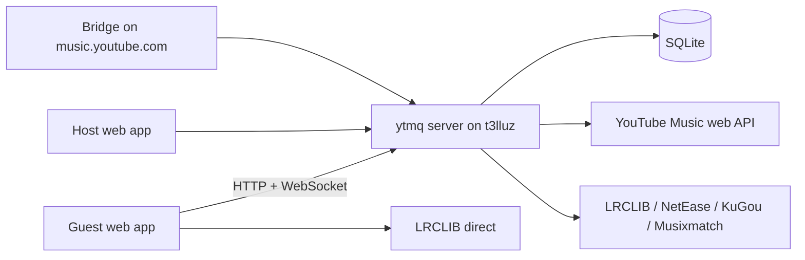

# YTMQ — Agent playbook

YouTube Music **shared queue**: the host plays in **YouTube Music**; **guests** use the **web app** to search and manage a **realtime shared queue**. Live at **https://t3lluz.com/ytmq/** (any case).

---

## Part 1 — Product

**Roles**
- **Host:** Creates lobby (link/QR/code). Playback only in **YouTube Music app** after setup. Does **not** need guest UI for daily use.
- **Guest:** Joins via web; search; add/remove/reorder queue; optional nickname.

**Features (priority)**

| P0 (today) | P1 (later) |
|------------|------------|
| Lobby create/join, QR, share link | Browser extension / ytmusicapi host bridge |
| Realtime queue: add, remove, reorder | Auto-inject into YT Music queue |
| Search songs (+ simple artist list) | Full artist discography, albums, play counts |
| Host tab: see queue, open `music.youtube.com/watch?v=` | Guest auth, moderation, PWA |

**UI:** Minimal, dark-friendly, mobile-first. **3 tabs:** Search | Queue | Room. Large touch targets; toasts; clear empty states.

**Non-goals v1:** In-app playback for guests, user accounts, payments, lyrics.

---

## Part 2 — Constraints (read before coding)

1. **No official YT Music queue API.** The host side is the bridge (`src/bridge/`), injected into music.youtube.com by the Chrome extension (`extension/`) or the userscript; it drives YT Music's own queue.
2. **Everything runs on t3lluz.** One Deno process (`server/main.ts`) serves the app, the API, the realtime WebSocket and the search/lyrics functions. There is no Supabase any more.
3. **Search** scrapes YouTube Music's own web API server-side (`server/functions/search`). No API key.
4. **ToS:** unofficial YT Music tooling is gray; personal/friends use.

---

## Part 3 — Stack

| Layer | Where |
|-------|-------|
| App | Vite + React + TS + Tailwind, base `/ytmq/` |
| API + realtime | `server/main.ts` (Deno 2.9), `server/realtime.ts` (WebSocket hub) |
| Data | SQLite (`node:sqlite`) in `~/docker/ytmq/data/ytmq.db`, schema in `server/db.ts` |
| Search / lyrics | `server/functions/search`, `server/functions/lyrics` (LRCLIB + NetEase + KuGou + Musixmatch) |
| Client | `src/lib/ytmqClient.ts` (shared by app and bridge), app singleton in `src/lib/api.ts` |
| Hosting | `~/docker/ytmq` on t3lluz, public through the `t3lluz-public` Cloudflare tunnel, tailnet through Caddy |
| Deploy | push to `main` → live within a minute (`deploy/server/update.sh`, `ytmq-deploy.timer`) |

No secrets. `VITE_API_URL` is optional (defaults to the app's own origin + `/ytmq/api`).

---

## Part 4 — Data model (`server/db.ts`)

**`rooms`:** `id`, `code` (6 chars, unique, case-insensitive), `host_token`, `password_hash` (PBKDF2), `locked`, `allow_guest_add|remove|controls`, `created_at`, `expires_at` (24 h). Never sent to clients except through the RPCs.

**`queue_items`:** `id`, `room_id`, `position` (unique per room; Play next = min − 1, Add to queue = max + 1, picked by the server), `video_id`, `title`, `channel_title`, `thumbnail_url`, `added_by`, `insert_mode` (`play_next` | `queue`), `created_at`.

**`participants`:** `room_id`, `client_id` (per device), `nickname`, `last_seen`, `kicked`.

**RPCs** (`POST /ytmq/api/rpc/<name>`, same names and `p_*` arguments as the old Postgres functions): `create_room`, `join_room`, `get_room`, `verify_room_password`, `set_room_settings`, `set_room_password`, `end_room`, `touch_participant`, `kick_participant`, `kick_by_nickname`, `leave_participant`, `purge_expired_rooms`.

**REST:** `GET|POST /rooms/<id>/queue`, `DELETE /queue/<itemId>`, `GET /rooms/<id>/participants`, `GET /rooms/<id>/counts`, `POST /broadcast`, `POST /functions/search|lyrics`, `GET /health`.

**Realtime** (`/ytmq/api/realtime`): channels with broadcast (`ytmq-bridge:<room>` for playback controls and queue removes, `ytmq-playback:<room>` for now playing) and table changes (`queue_items`, `participants`, `room_settings`) for one room. The client keeps supabase-js's channel shape: `ytmq.channel(topic).on('broadcast' | 'changes', …).subscribe(cb)`.

---

## Part 5 — Routes

| Path | Purpose |
|------|---------|
| `/ytmq/` | Create lobby \| Join with code |
| `/ytmq/room/:roomId` | Guest (and host) room: Search \| Queue \| Lyrics \| Room \| Admin |
| `/ytmq/host/:roomId` | Host entry; `host_token` lives in `sessionStorage` |

---

## Part 6 — Working on it

- Work in `~/projects/ytmq`. Never edit `~/docker/ytmq/repo` (the deploy checkout).
- `npm run dev` + `cd server && deno task dev` for local work (Vite proxies `/ytmq/api` to :8787). `YTMQ_API_PROXY=https://t3lluz.com npm run dev` uses the live API instead.
- Push to `main` and it is live in about a minute. A failed build leaves the previous one up; see `journalctl --user -u ytmq-deploy`.
- Server details and operations: [deploy/server/README.md](../deploy/server/README.md).

---

## Part 7 — Smoke tests (deployed)

- [ ] Create lobby → QR works on phone
- [ ] Join with code
- [ ] Search → add 3 tracks → 2nd tab updates <1s
- [ ] Remove a track; YT Music queue follows
- [ ] Host connects YouTube Music via the extension; guest add lands in the YT Music queue
- [ ] Playback controls from a guest phone move YT Music

---

## Part 8 — Architecture

```mermaid
flowchart LR
  G[Guest web app] -->|HTTP + WebSocket| S[ytmq server on t3lluz]
  H[Host web app] --> S
  B[Bridge on music.youtube.com] --> S
  S --> DB[(SQLite)]
  S --> YTM[YouTube Music web API]
  S --> LY[LRCLIB / NetEase / KuGou / Musixmatch]
  G --> LRC[LRCLIB direct]
```

**Lyrics sourcing.** The browser hits LRCLIB directly for the fastest happy path. In parallel it calls the server's `lyrics` function, which aggregates LRCLIB + NetEase Cloud Music + KuGou + Musixmatch (none of which ship CORS headers). The first source to return time-synced lyrics wins; it falls back to plain/instrumental matches when nothing has synced.
